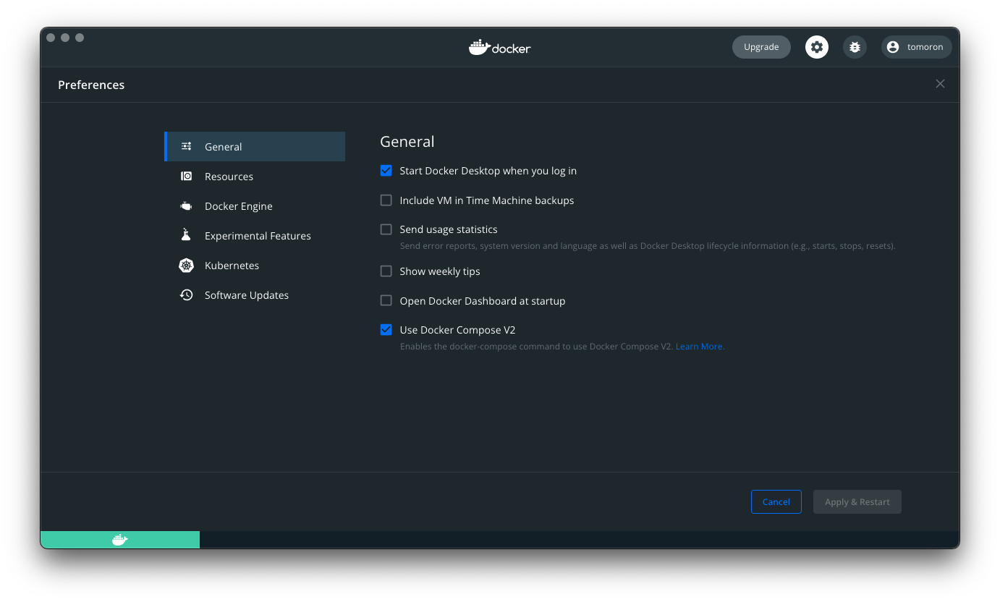

<!--
title:   【Docker】Docker Desktopで%CPUが100%なってしまうバグ
tags:    Docker,Docker_Desktop,Mac
id:      de164fbf852709a6e116
private: false
-->

# はじめに

Docker Desktop の version を上げたら docker の CPU の使用率が 100%近くまで使ってしまうバグが発生しています。

## 環境

- macOS 12.3.1
- Docker Desktop 4.6.1

# 解決法

設定の`Open Docker Dashboard at startup`のチェックを外すことで問題が解決します。

# 参考

[Github](https://github.com/docker/fozr-mac/issues/6166)